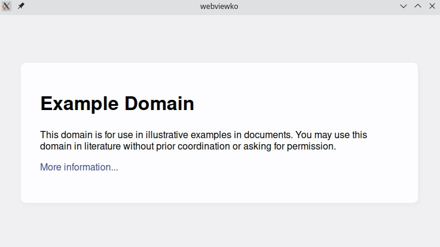

# webviewkoCLI


[](https://github.com/Winterreisender/webviewkoCLI/actions/workflows/gradle-ci.yml)


<!-- **English** | [中文(简体)](docs/README.zh-Hans.md) | [中文(繁體)](docs/README.zh-Hant.md) -->

A simple commandline interface for [webviewko](https://github.com/Winterreisender/webviewko).

webviewko provides a Kotlin/Java binding to [webview](https://github.com/webview/webview), a tiny cross-platform webview library to build modern cross-platform GUIs using [WebView2](https://developer.microsoft.com/en-us/microsoft-edge/webview2/), WebKit and [WebKitGTK](https://webkitgtk.org/).



## Getting Started

### Prerequisite

A x64 system with Java 8+ (JVM), Windows 7+ x64 (Kotlin/Native) or Linux x64

### Reference

```shell
Arguments: 
    url -> URI/URL { String }
Options: 
    --title, -t [webviewko] -> window title { String }
    --width [800] -> window width in px { Int }
    --height [600] -> window height in px { Int }
    --hint [None] -> window hint { Value should be one of [none, minimum, maximum, fixed] }
    --debug [false] -> use debug mode 
    --init [] -> JS to run on page loading { String }
    --help, -h -> Usage info 
```

### Examples

Simplest way to open a web page:

```shell
java -jar webviewkocli.jar https://example.com
```

Setting the title, size and window hint:

```shell
java -jar webviewkocli.jar https://example.com --width 800 --height 600
```

Setting the JS code to be executed on loading:

```shell
java -jar webviewkocli.jar https://example.com --init "alert('Hello World!')"
```

Use Kotlin/Native program:

```shell
webviewkocli.kexe https://example.com --title example --width 800 --height 600 --hint fixed
```

## Contribution

All suggestions, pull requests, issues and other contributions are welcome and appreciated.

## Credits

| Project                                                                      | License                                                                                          |
|------------------------------------------------------------------------------|--------------------------------------------------------------------------------------------------|
| [Kotlin & kotlinx](https://kotlinlang.org/)                                  | [Apache-2.0](https://github.com/JetBrains/kotlin/blob/master/LICENSE)                            |

## License

Copyright 2022 Winterreisender

Licensed under the Apache License, Version 2.0 (the "License"); you may not use this file except in compliance with the License. You may obtain a copy of the License at http://www.apache.org/licenses/LICENSE-2.0  
Unless required by applicable law or agreed to in writing, software distributed under the License is distributed on an "AS IS" BASIS, WITHOUT WARRANTIES OR CONDITIONS OF ANY KIND, either express or implied.  
See the License for the specific language governing permissions and limitations under the License.

SPDX short identifier: **Apache-2.0**


